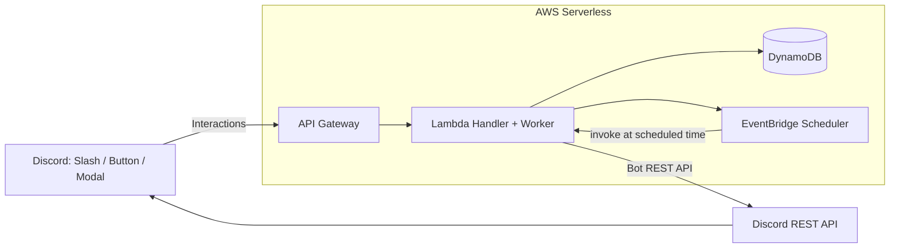

## 概要 (Overview)
このBotは、Discordサーバーで行われるイベントの参加者管理や連絡事項の確認を、手動ではなく自動化できないかと考えて開発しました。
イベント参加者の管理や連絡の未確認者へのリマインドをBotが行うことで、サーバー運営者の負担を減らし、参加者の連絡の見逃しを防ぐことを目的としています。

## Overview
This bot was developed to automate event participation management and announcement tracking in Discord servers.

In many communities, event participation and confirmation of announcements are managed manually.
This project aims to reduce the workload of server administrators by allowing a bot to manage event participation and send reminders to users who have not confirmed announcements.

# Discord Event & Notice Bot (AWS Serverless)
イベント参加者への開催前通知と連絡未確認者への自動リマインドを自動化するDiscordサーバレスBotです。
EventBridge Scheduler と Lambda 非同期ワーカー設計で通知処理を実現しています。

## Demo / 操作イメージ

- `/event create` でイベント募集を投稿（参加/取消/締切ボタン付き）

連絡はイベントを作成したチャンネルと別のチャンネルに設定可能（例：連絡専用チャンネルに連絡だけ集約）

- 「連絡を作成」→ Modal で連絡投稿（確認ボタン付き）

- 「連絡一覧」→ ephemeral で一覧表示（開く/close/非表示/再表示）

開くを押すと該当の連絡に飛ぶことができる。

- 未確認者へリマインド（Scheduler → Lambda → Discord投稿）

---
## Architecture

### 構成要素

- Discord Interactions（Ed25519 署名検証）
- API Gateway → Lambda（Lambda Proxy統合）
- DynamoDB（Events / EventMembers / Notices / NoticeAcks）
- EventBridge Scheduler（時刻駆動リマインド）

---
## Features

### Event
- イベント募集投稿（参加者一覧を自動更新）
- イベント開催日時の指定
- 参加 / 参加取消
- 募集締切（締切後は参加不可）

### Notice
- 連絡投稿（確認ボタンでAck管理）
- 連絡一覧を ephemeral で表示（表示/非表示の切替）
- close（確認受付終了・ボタン削除）

### Reminder System
- イベント開催24時間前に参加者へ自動メンション通知
- 連絡未確認者への個別リマインド
- 指定時刻通知 / 前日通知の両対応
- EventBridge Scheduler → Lambda → Discord投稿
- 手動操作不要の自動運用

---

## Tech Stack
- Python
- AWS Lambda / API Gateway / DynamoDB / EventBridge Scheduler
- Discord API (Interactions + REST)
- PyNaCl（署名検証）

---

## Security
- Discord Interactions の署名検証（x-signature-ed25519 / x-signature-timestamp）
- Bot Token / Public Key 等は **環境変数で管理**（リポジトリには含めません）

---

## Setup (Local / Deployment)
### Environment Variables
`.env.example` を参考に環境変数を設定してください。

必須:
- `DISCORD_PUBLIC_KEY`
- `DISCORD_BOT_TOKEN`
- `DDB_EVENTS_TABLE`
- `DDB_EVENT_MEMBERS_TABLE`
- `DDB_NOTICES_TABLE`
- `DDB_NOTICE_ACKS_TABLE`
- `SCHEDULER_ROLE_ARN`
- `TARGET_LAMBDA_ARN`

### AWS Resources
- DynamoDB テーブル（上記4つ）
- EventBridge Scheduler が Lambda invoke するための IAM Role（`SCHEDULER_ROLE_ARN`）

---

## Design Notes (工夫点)
- Discord Interactions の **3秒制限**に対応するため、重い処理は **非同期ワーカー（同一LambdaをEvent invoke）**で実行
- DynamoDB put_item に `ConditionExpression` を使い、二重参加/二重Ackを防止
- Scheduler は create / update を使い分け、リマインド時刻の再設定に対応

---

## Detailed Design

より詳しい設計資料:

- Architecture 詳細 → docs/architecture.md
- DynamoDB 設計 → docs/dynamodb.md
- 処理シーケンス → docs/sequence.md
- セキュリティ設計 → docs/security.md
