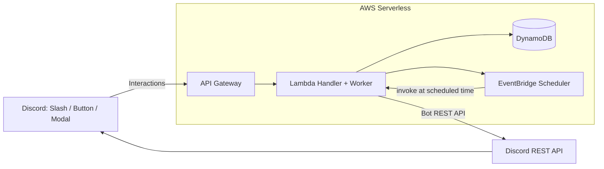

# Architecture Design

## Overview

Discord Event & Notice Bot は、
Discord Interactions を入口とするサーバレス構成で
イベント管理とリマインド通知を自動化するシステムです。

AWS Lambda / DynamoDB / EventBridge Scheduler を中心に構成し、
サーバ常駐なしで時刻駆動通知を実現しています。

---

## System Architecture

---

## Request Flow

通常の処理フロー:

1. ユーザーが Discord 上で Slash Command / Button を操作
2. Discord Interactions が API Gateway 経由で Lambda に送信
3. Lambda が Ed25519 署名検証を実行
4. 正規リクエストのみ処理
5. DynamoDB にイベント・連絡情報を保存
6. 必要に応じて Scheduler にリマインド登録

---

## Asynchronous Worker Design

Discord Interactions は 3秒以内に応答しなければタイムアウトします。

イベント作成や通知投稿などの重い処理は:

- Lambda を非同期 invoke
- 同一関数をワーカーとして再実行

する設計にしています。

これにより:

- Discord の3秒制限を回避
- UIレスポンスを即時返却
- 重い処理を安全に実行

できます。

---

## Reminder System

リマインドは EventBridge Scheduler の
`at()` 式を利用した時刻駆動処理です。

用途:

- イベント開催24時間前通知
- 連絡未確認者へのリマインド

Scheduler → Lambda → Discord 投稿

の流れで完全自動実行されます。

常駐サーバや cron 管理は不要です。

---

## Design Goals

本システムは以下を目標に設計されています:

- 手動通知作業の自動化
- Discordコミュニティ運用の効率化
- AWSサーバレス設計の実践
- 拡張可能なイベント管理基盤
