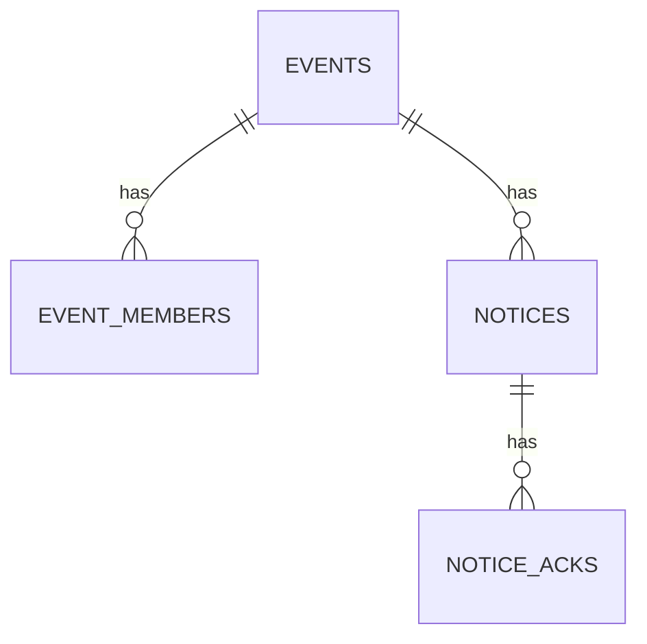

# DynamoDB Data Model

本Botは以下4テーブルで、イベント募集・参加者・連絡・確認(Ack)を管理します。

- Events
- EventMembers
- Notices
- NoticeAcks

---

## Access Patterns（取得したいもの）

### Event
- イベント詳細を取得する（guild_id + event_id）
- イベントの状態（OPEN/CLOSED）や開催日時を参照する
- 募集メッセージの message_id を保持し、編集更新に使う

### EventMembers
- イベント参加者一覧を取得する（guild_id で query + event_id prefix）
- 参加者の追加（重複参加を防止）
- 参加取消（delete）

### Notices
- イベントに紐づく連絡一覧を取得する（GSI: guild_id + event_id prefix）
- OPEN中の連絡が存在するか確認する（一覧から探索）
- 連絡の状態（OPEN/CLOSED）や is_hidden を管理する

### NoticeAcks
- 連絡の確認済み数を取得する（guild_id で query + notice_id prefix）
- 連絡未確認者を出す（参加者集合 - ack済み集合）

---

## ER / Relationship（概念図）

※ DynamoDBはRDBの外部キー制約はありませんが、データの関係性としては上記の形です。

---

## Tables

### 1) Events
イベント本体。

- **PK**: `guild_id`
- **SK**: `event_id`（例: `EVT#<uuid>`）

主な属性（例）:
- `title` / `status`（OPEN/CLOSED）
- `created_by` / `created_by_name` / `created_at`
- `recruit_channel_id` / `recruit_message_id`（募集投稿の編集更新に使用）
- `notice_channel_id`（連絡投稿先）
- `event_start_at`（ISO文字列, JST）
- `event_remind_at`（ISO文字列, JST）
- `event_remind_schedule_name`（Scheduler名）

---

### 2) EventMembers
イベント参加者。

- **PK**: `guild_id`
- **SK**: `member_key`（例: `EVT#...#USER#<user_id>`）

キー形式:
- `member_key = "{event_id}#USER#{user_id}"`

主な属性（例）:
- `event_id`
- `user_id` / `username`
- `joined_at`

利用例:
- 参加者一覧: `begins_with("{event_id}#USER#")`
- 二重参加防止: `ConditionExpression attribute_not_exists(member_key)`

---

### 3) Notices
イベント内の「連絡」投稿（確認ボタン付き）。

- **PK**: `guild_id`
- **SK**: `notice_id`（例: `NTC#<uuid>`）

主な属性（例）:
- `event_id`
- `status`（OPEN/CLOSED）
- `is_hidden`（一覧の表示/非表示）
- `notice_channel_id` / `notice_message_id`
- `title` / `body`
- `created_by` / `created_by_name` / `created_at`
- `remind_at`（ISO文字列, JST, 任意）
- `remind_schedule_name`（Scheduler名, 任意）

#### GSI: gsi_event（イベント単位の連絡一覧取得）
- **GSI PK**: `guild_id`
- **GSI SK**: `event_sk`

`event_sk` の形式:
- `event_sk = "{event_id}#{created_at}#{notice_id}"`

利用例:
- 連絡一覧: `Key(guild_id) AND begins_with(event_sk, "{event_id}#")`
- 並び順: `created_at` が含まれるため、新しい順にソート可能

---

### 4) NoticeAcks
連絡の確認済み（Ack）管理。

- **PK**: `guild_id`
- **SK**: `ack_key`（例: `NTC#...#USER#<user_id>`）

キー形式:
- `ack_key = "{notice_id}#USER#{user_id}"`

主な属性（例）:
- `notice_id` / `event_id`
- `user_id` / `username`
- `acked_at`

利用例:
- Ack数: `begins_with("{notice_id}#USER#")`
- 二重Ack防止: `ConditionExpression attribute_not_exists(ack_key)`

---

## Notes（設計メモ）

- DynamoDBは「取りたいクエリ」から逆算してキーを設計しています（Query中心）。
- EventMembers / NoticeAcks は `begins_with(prefix)` を使って、
  1イベント/1連絡に紐づくユーザー集合を効率的に取得できる設計です。
- Notices はイベントごとの一覧取得が必要なため、GSI（gsi_event）でイベント単位の取得を可能にしています。
