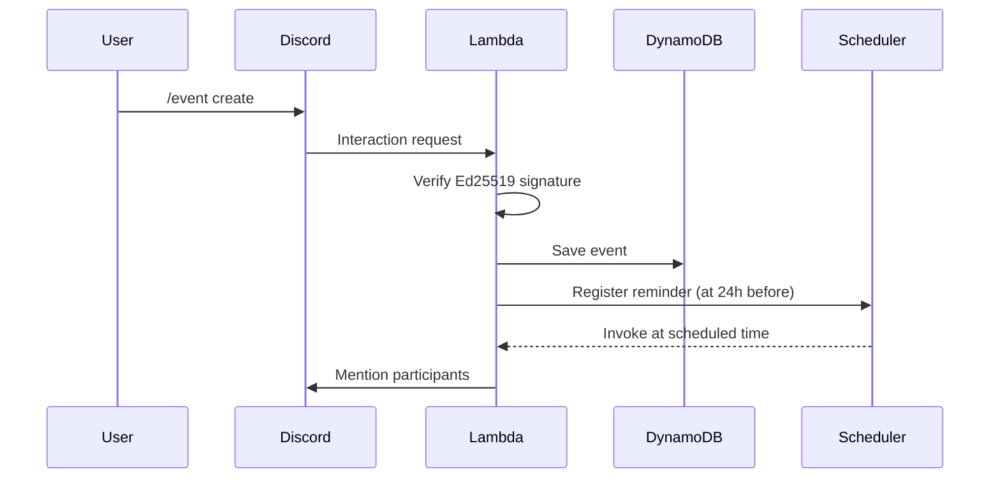

# Sequence Design

## Event Creation → Reminder Registration

イベント作成からリマインド登録までの処理フローです。

```mermaid
sequenceDiagram
    participant User
    participant Discord
    participant Lambda
    participant DynamoDB
    participant Scheduler

    User->>Discord: /event create
    Discord->>Lambda: Interaction request
    Lambda->>Lambda: Verify Ed25519 signature

    Lambda->>DynamoDB: Save event
    Lambda->>Scheduler: Register reminder (at 24h before)

    Scheduler-->>Lambda: Invoke at scheduled time
    Lambda->>Discord: Mention participants
```
